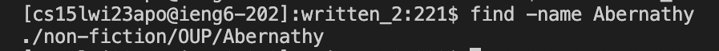
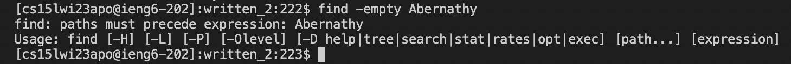
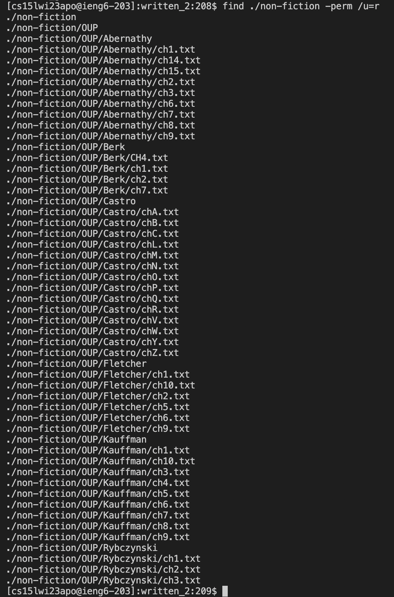
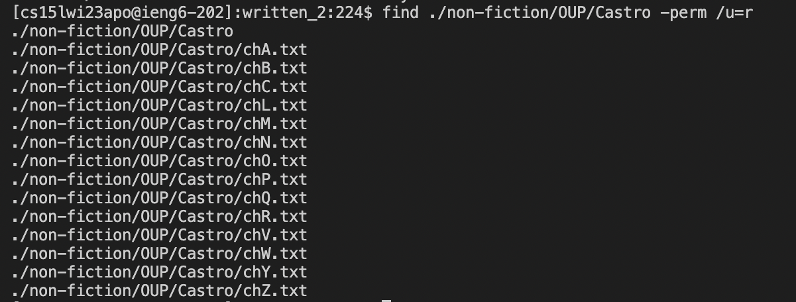
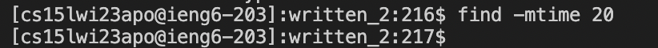

# Lab Report 5
In Lab 3, I researched on different command options we can use with `grep` to make the use of grep easier. This time I'm gonna research on `find`.
The `find` command helps us to define those criteria to narrow down the exact files we would want to search for. Few commands that can be used along with `find` that can further help in finding exact files are as follows:
- `find -name "query"`
- `find -empty`
- `find "file path" -perm /u=r`
- `find -mtime "time in days"`


**`find -name`**\
The -name option enables us to search for files that are specified by the query mentioned by the user.


Example 1:\
*Command-line statement*
```
# Example 1 of find -name 
find -name ch1.txt
```
*Output*\


Example 2:\
*Command-line statement*
```
# Example 2 of find -name
find -name Abernathy
```
*Output*\



**`find -empty`**\
The -empty searches for empty files and directories.


Example 1:\
*Command-line statement*
```
# Example 1 of find -empty
find -empty
```
*Output*\
\
When there are no empty files, it displays nothing.


Example 2:\
*Command-line statement*
```
# Example 2 of find -empty
find -empty Abernathy
```
*Output*\
\
Here the output is a little different. This is because we do not need to specify the location to check empty files or directories it searches all the files in the directory and other sub-directories present in the directory.


**`find -perm /u=r`**\
The -perm /u=r gives all the "READ ONLY" files in the specified path.


Example 1:\
*Command-line statement*
```
# Example 1 of find -perm /u=r
find ./non-fiction -perm /u=r
```
*Output*\



Example 2:\
*Command-line statement*
```
# Example 2 of find -perm /u=r
find ./non-fiction/OUP/Castro -perm /u=r
```
*Output*\



**`find -mtime`**\
The -mtime enables us to find all files which have been modified on the mentioned days.


Example 1:\
*Command-line statement*
```
# Example 1 of find -mtime
find -mtime 20
```
*Output*\



Example 2:\
*Command-line statement*
```
# Example 2 of find -mtime
find -mtime 1
```
*Output*\


There are many other queries which can further help us in finding the files we need. Trying them out can be interesting and fun !\
Below I've listed few examples to try.
- -user name : Search for files owned by user name or ID ‘name’.
- -print : Display the path name of the files found by using the rest of the criteria.
- -inum N : Search for files with inode number ‘N’.
- -links N : Search for files with ‘N’ links.
- -atime "number": Find all the files which are accessed "number" days back.
